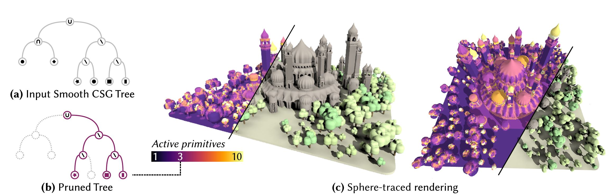

# Lipschitz Pruning: Hierarchical Simplification of Primitive-Based SDFs

Wilhem Barbier*, Mathieu Sanchez*, Axel Paris, Élie Michel, Thibaud Lambert, Tamy Boubekeur, Mathias Paulin, Théo Thonat

(* joint first authors)



🌐 [**Project page**](https://wbrbr.org/publications/LipschitzPruning)

📰 Published in *Computer Graphics Forum* (Eurographics 2025)

🏆 Received an Honorable Mention for the Best Paper award

📢 Presented at **SIGGRAPH 2025**


## Abstract

Rendering tree-based analytical Signed Distance Fields (SDFs) through sphere tracing often requires to evaluate many primitives per tracing step, for many steps per pixel of the end image. This cost quickly becomes prohibitive as the number of primitives that constitute the SDF grows. In this paper, we alleviate this cost by computing local pruned trees that are equivalent to the full tree within their region of space while being much faster to evaluate. We introduce an efficient hierarchical tree pruning method based on the Lipschitz property of SDFs, which is compatible with hard and smooth CSG operators. We propose a GPU implementation that enables real-time sphere tracing of complex SDFs composed of thousands of primitives with dynamic animation. Our pruning technique provides significant speedups for SDF evaluation in general, which we demonstrate on sphere tracing tasks but could also lead to significant improvements for SDF discretization or polygonization. 

## Prebuilt executables

Windows executables are available as [releases](https://github.com/wbrbr/LipschitzPruning/releases). The executable should be run from the `bin` subdirectory:
```
cd bin
LipschitzPruning.exe
```


# Build from source

## Dependencies

- Vulkan SDK

## Build

* Install the Vulkan SDK. (Ubuntu 24.04 instructions: `apt install libvulkan-dev libvulkan-memory-allocator-dev glslc libglfw3-dev`)
* Fetch the submodules: `git submodule update --init --recursive`
* Build:
```
mkdir build
cd build
cmake ..
cmake --build .
```

## Run

The executable should be run from the `build` folder. Examples:
* Linux build: `./LipschitzPruning`
* Windows build (Debug): `Debug\LipschitzPruning.exe`


# Assets
The *Trees* and *Monument* scenes are courtesy of Élie Michel and available under the CC-BY 4.0 licence (Creative Commons with attribution).


The *Molecule* scene is borrowed from the paper [Segment Tracing Using Local Lipschitz Bounds](https://aparis69.github.io/public_html/projects/galin2020_Segment.html) by Galin et al.
